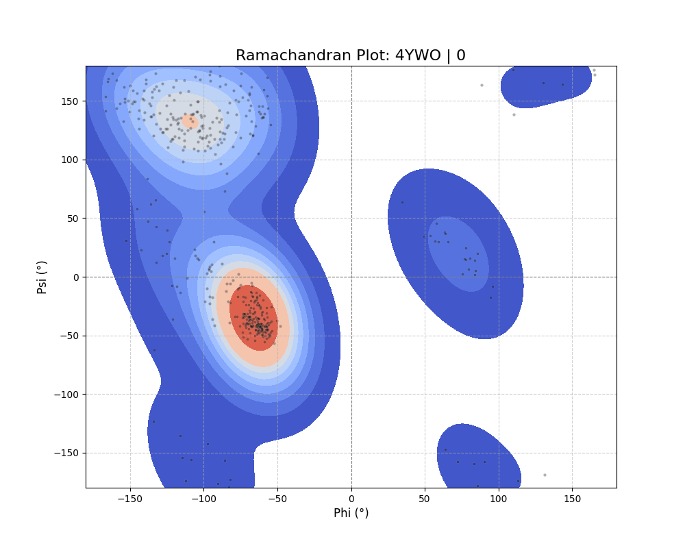

# Ramchandran Plotter For PDB Files

Script generates Ramachandran plots for protein structures from PDB files. Ramachandran plots are a way to visualize dihedral angles ψ against φ of amino acid residues in protein structure. This tool helps in analyzing the conformational angles of the protein backbone.

## Requirements

- biopython==1.84
- contourpy==1.3.1
- cycler==0.12.1
- fonttools==4.55.1
- kiwisolver==1.4.7
- matplotlib==3.9.3
- numpy==2.1.3
- packaging==24.2
- pandas==2.2.3
- pillow==11.0.0
- pyparsing==3.2.0
- python-dateutil==2.9.0.post0
- pytz==2024.2
- seaborn==0.13.2
- six==1.16.0
- tzdata==2024.2


## Installation

```
pip install -r requirements.txt
```

## Usage

```
py get_plots.py -f <PDB_FILE_PATH>
```

### Example Result

```
py get_plots.py -f 4ywo.pdb
```


